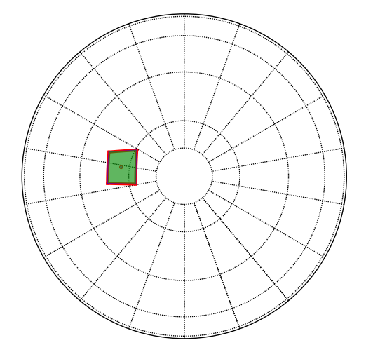

User documentation
==================

The ``spherical_geometry`` library is a Python package for handling spherical
polygons that represent arbitrary regions of the sky.

Requirements
------------

- Python 3.5 or later

- Numpy 1.10.0 or later

- astropy 0.4 or later

- qd-library 2.3.7 or later (optional: if not available, the
  bundled version will be used).  To force using the system-installed
  version, build with ``USE_SYSTEM_QD=1 setup.py build``.

Bundled qd-library
------------------

Origin: https://www.davidhbailey.com/dhbsoftware/qd-2.3.22.tar.gz

- A custom ``libqd/include/qd/qd_config.h`` is provided to circumvent the need
  to run any configuration scripts. This generalized configuration may not be
  optimized for your system.

- The ``spherical_geometry`` test suite fail when linked to a system-optimized
  ``qd`` library, because the tests are written for the general case.

Coordinate representation
-------------------------

Coordinates in world space are traditionally represented by right
ascension and declination (*ra* and *dec*), or longitude and latitude.
While these representations are convenient, they have discontinuities
at the poles, making operations on them trickier at arbitrary
locations on the sky sphere.  Therefore, all internal operations of
this library are done in 3D vector space, where coordinates are
represented as (*x*, *y*, *z*) vectors.  The ``spherical_geometry.vector`` module
contains functions to convert between (*ra*, *dec*) and (*x*, *y*,
*z*) representations.

While any (*x*, *y*, *z*) triple represents a vector and therefore a
location on the sky sphere, a distinction must be made between
normalized coordinates that fall exactly on the unit sphere, and
unnormalized coordinates which do not.  A normalized coordinate is
defined as a vector whose length is 1, i.e.:

.. math::

    \sqrt{x^2 + y^2 + z^2} = 1

To prevent unnecessary recomputation, many methods in this library
assume that the vectors passed in are already normalized.  If this is
not the case, ``spherical_geometry.vector.normalize_vector`` can be used to
normalize an array of vectors.

When not working in Cartesian vectors, the library allows the user to
work in either degrees or radians.  All methods that require or return
an angular value have a ``degrees`` keyword argument.  When
``degrees`` is ``True``, these measurements are in degrees, otherwise
they are in radians.

Spherical polygons
------------------

Spherical polygons are arbitrary areas on the sky sphere enclosed by
great circle arcs.  They are represented by the
``~spherical_geometry.polygon.SphericalPolygon`` class.

Representation
``````````````

The points defining the polygon are available from the
``~polygon.SphericalPolygon.points`` property.  It is a Nx3 array where
each row is an (*x*, *y*, *z*) vector, normalized.  The polygon points
are explicitly closed, i.e., the first and last points are the same.

Where is the inside?
^^^^^^^^^^^^^^^^^^^^

The edges of a polygon serve to separate the “inside” from the
“outside” area.  On a traditional 2D planar surface, the “inside” is
defined as the finite area and the “outside” is the infinite area.
However, since the surface of a sphere is cyclical, i.e., it wraps
around on itself, the a spherical polygon actually defines two finite
areas.  To specify which should be considered the “inside” vs. the
“outside”, the definition of the polygon also has an “inside point”
which is just any point that should be considered inside of the
polygon.

In the following image, the inside point (marked with the red dot)
declares that the area of the polygon is the green region, and not the
white region.



The inside point of the the polygon can be obtained from the
``~polygon.SphericalPolygon.inside`` property.

What is the orientation?
^^^^^^^^^^^^^^^^^^^^^^^^

The correctness of several of the algorithms using polygons depends on
a consistent orientation of the points defining it. That is, the points
should have a clockwise order. When creating a new spherical polygon,
the order of the points defining a polygon will be reversed if they are
not in clockwise order. The method ``SphericalPolygon.is_clockwise`` is
used to est if the points are in clockwise order. It takes two
successive sides and computes the normal vector to the sides. If the
normal vector points inward towards the center of the sphere, the two
sides are counter clockwise. If the normal vector points outward, the
two sides are clockwise. The code determines the orientation by
computing the triple product of the two sides with the vertex of the
the two sides. Summing the triple product over all the sides gives the
predominant orientation of the points in the polygon.


Disjoint Polygons
^^^^^^^^^^^^^^^^^

If a polygon is the result of the intersection of polygons, it may be
disjoint. Disjoint polygons are represented as a list of spherical
polygons. The library handles the details of this internally. However,
the user must be aware that several of the properties of polygons are
generators and return the value for a single polygon at a time. To
access all the values of a proeprty, either use a for loop, or coerce
the property to a list. The properties which are generators are:

  - ``SphericalPolygon.points``: The points defining each polygon

  - ``SphericalPolygon.inside`` : The inside point of each polygon


If the intersection of two polygons generates disjoint polygons the
code computes a new interior point for the disjoint polygons.

Creating spherical polygons
```````````````````````````

``SphericalPolygon`` objects have 5 different constructors:

  - ``SphericalPolygon``: Takes an array of (*x*, *y*, *z*) points, or a
    list of disjoint ``SphericalPolygon`` instances.

  - ``SphericalPolygon.from_radec``: Takes an array of (*ra*, *dec*)
    points and an inside point.

  - ``SphericalPolygon.from_cone``: Creates a polygon from a cone on the
    sky shere.  Takes (*ra*, *dec*, *radius*).

  - ``SphericalPolygon.from_wcs``: Creates a polygon from the footprint
    of a FITS image using its WCS header keywords.  Takes a FITS
    filename or a ``astropy.io.fits.Header`` object.

  - ``SphericalPolygon.convex_hull``: Creates a polygon that is the
    convex hull of a list of points.

Operations on Spherical Polygons
````````````````````````````````

Once one has a ``SphericalPolygon`` object, there are a number of
operations available:

  - ``~SphericalPolygon.contains_point``: Determines if the given point
    is inside the polygon.

  - ``~SphericalPolygon.intersects_poly``: Determines if one polygon
    intersects with another.

  - ``~SphericalPolygon.area``: Determine the area of a polygon.

  - ``~SphericalPolygon.union`` and ``~SphericalPolygon.multi_union``:
    Return a new polygon that is the union of two or more polygons.

  - ``~SphericalPolygon.intersection`` and
    ``~SphericalPolygon.multi_intersection``: Return a new polygon that
    is the intersection of two or more polygons.

  - ``~SphericalPolygon.overlap``: Determine how much a given polygon
    overlaps another.

  - ``~SphericalPolygon.to_radec``: Convert (*x*, *y*, *z*) points in the
    polygon to (*ra*, *dec*) points.

  - ``~SphericalPolygon.draw``: Plots the polygon using matplotlib’s
    Basemap toolkit.  This feature is rather bare and intended
    primarily for debugging purposes.

Great circle arcs
-----------------

As seen above, great circle arcs are used to define the edges of the
polygon.  The ``spherical_geometry.great_circle_arc`` module contains a number of
functions that are useful for dealing with them.

- ``length``: Returns the angular distance between two points on the sphere.

- ``intersection``: Returns the intersection point between two great
  circle arcs.

- ``intersects``: Determines if two great circle arcs intersect.

- ``intersects_point``: Determines if a point is along the great circle
  arc.

- ``angle``: Calculate the angle between two great circle arcs.

- ``midpoint``: Calculate the midpoint along a great circle arc.
